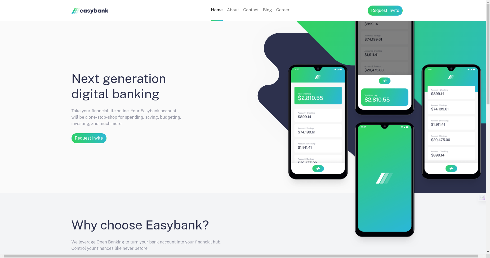
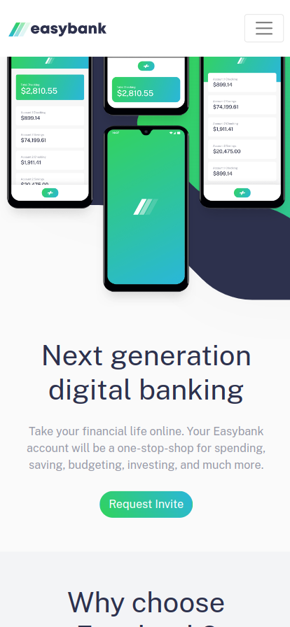

# Frontend Mentor - Easybank landing page solution

This is a solution to the [Easybank landing page challenge on Frontend Mentor](https://www.frontendmentor.io/challenges/easybank-landing-page-WaUhkoDN). Frontend Mentor challenges help you improve your coding skills by building realistic projects.

## Table of contents

- [Overview](#overview)
  - [The challenge](#the-challenge)
  - [Screenshot](#screenshot)
  - [Links](#links)
  - [Built with](#built-with)
  - [What I learned](#what-i-learned)

**Note: Delete this note and update the table of contents based on what sections you keep.**

## Overview

### The challenge

Users should be able to:

- View the optimal layout for the site depending on their device's screen size
- See hover states for all interactive elements on the page

### Screenshot

### Links

- Solution URL: [solution URL here](https://www.frontendmentor.io/profile/karthick12122000/solutions)
- Live Site URL: [Live site URL ](https://karthick12122000.github.io/Easybank_landing_page/)

### Built with

- Semantic HTML5 markup
- CSS custom properties
- Flexbox
- CSS Grid
- Mobile-first workflow
- Bootstrap 5

### What I learned

Throughout my project, I had the opportunity to learn and implement Bootstrap 5, a powerful front-end framework. Bootstrap 5 allowed me to enhance the aesthetics and functionality of my project efficiently. I gained hands-on experience with responsive web design, utilizing Bootstrap's grid system to create flexible and mobile-friendly layouts
